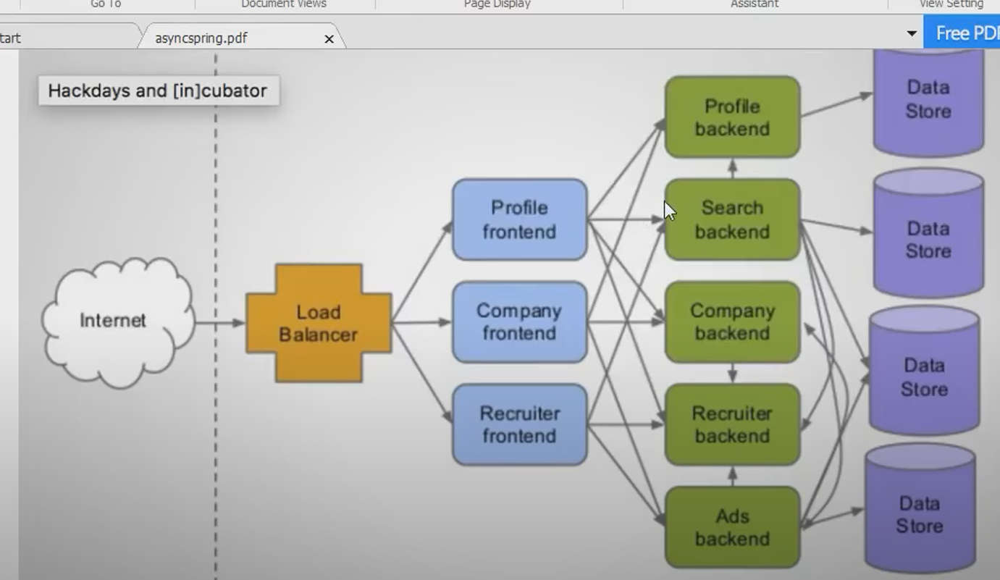
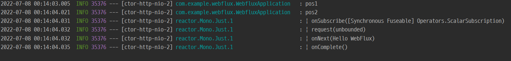
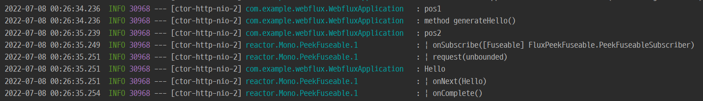
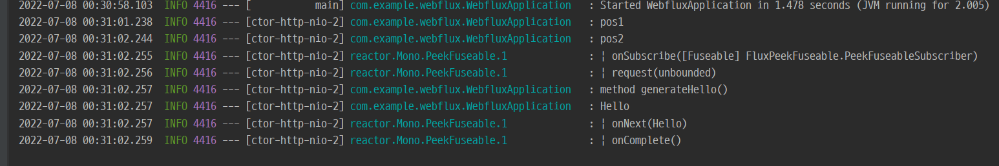
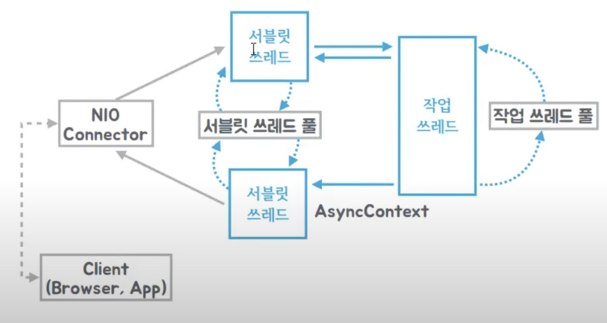
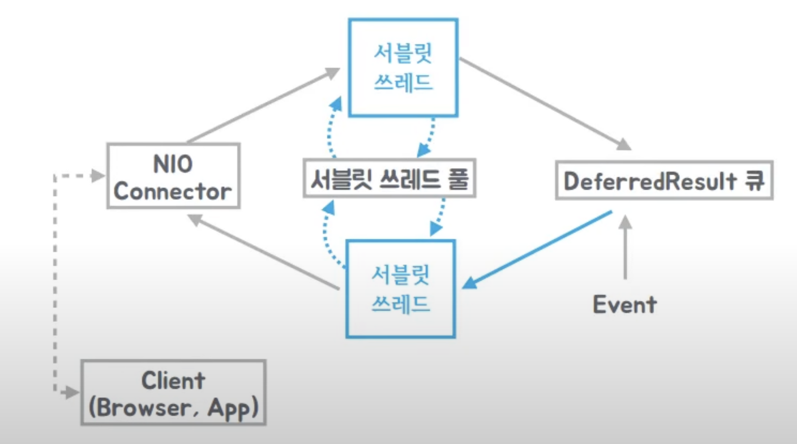

리액티브 프로그래밍

- 외부의 이벤트나 데이터가 발생하면 거기에 대응하는 방식으로 프로그래밍을 하는 것을 통틀어서 말할 수 있다.

### Iterable Interface


해당 인터페이스를 구현한 객체는 for-each문에서 타겟이 될 수 있다.

# Duality(쌍대성)

이해하기 쉽지않은 표현일 수 있는데 리액티브 프로그래밍으로 이야기 할 때 항상 하는 단어로 Duality가 언급됨.

- Iterable ↔ Observeralbe
- 궁극적인 기능은 같은데 반대 방향으로 표현하는 것이 쌍대성임.
    - 옵져버블과 이터러블이 쌍대성 관계
- Iterable
    - pull 방식
        - 받는 쪽에서 요청후에 끌어 받아서 사용하는 방식
- Observerable
    - push 방식
        - 어떤 데이터가 이벤트를 가지고있는 소스쪽에서 밀어넣어주는 방식
        - 사실 GoF의 옵저버 패턴에 잘 나와있음.


# Observer 패턴

옵저버 패턴은 push방식으로 장점이 많음.

→ 따로 미리 만들어놓은 데이터를 끌어오는 용도보다 훨씬 다이나믹하게 데이터가 만들어 내면(키보드 입력, db에서 가져오고…) 관심있어하는 모든 애들(옵저버)한테 전부 브로드캐스팅 할 수 있다.

Reactive Extentions을 만든 ms 개발자들은 옵저버 패턴은 부족하다. → 더 좋게 만들 수 있다.

2가지 지적.

1. 데이터를 전부 주어도 끝이라는  **Complete**라는 개념이 없음.
2. **Error** 처리에 대한 개념이 없음.
    1. 익셉션에 대한 처리를 할 수 없음.
        1. 예외를 받았지만 재시도 or 다른방식으로 시도등을 고려되어있지 않음.
    2. 익셉션의 발생이 버그때문에 발생할 수 있지만(이 경우 빠르게 대처해야 하지만) 복구 가능한 예외가 발생할 수 있음.

### 그래서 위 문제점 두가지를 추가해서 확장된 observable을 만들었음

→ 확장된 observer 패턴이 Reactive Programming의 큰 축중 하나임. (총 3가지 정도 있음)

# Reactive Streams (표준)

([https://www.reactive-streams.org/](https://www.reactive-streams.org/))

([https://reactivex.io/](https://reactivex.io/))

- JVM 언어를 이용하는 기술을 만드는 회사들이 reactive 관련된 기술들이 붐이 일어나는데 중구난방으로 막 개발하는 것이 아닌 적당한 레벨의 표준을 정한 것.
- Java9 API에서는 들어간 내용도 있음.

자바안에서 여러 프로젝트에서도 Reactive Streams 라는 표준을 지켜서 개발을 하고 있음.

엔진은 pivotal에서 만든 Reactor로 만들어짐.

리액터의 퍼블리셔가 만약 Rxjava에서 만들어진것이면 따로 어댑터를 만들 필요가 없을 수 있음.

Reactive-Streams의 동작 원리를 알면 다른 툴들을 볼 때 잘 보일 수 있음.

Reactive-Streams의 각 인터페이스가 준수해야 하는 스펙이 있음.([링크](https://github.com/reactive-streams/reactive-streams-jvm/blob/v1.0.4/README.md#specification))

1. Publisher (11가지)
2. Subscriber (13가지)
3. Subscription (17가지)
4. Processor (2가지)

## Publisher

- 잠재적으로 한계가 없는 연속된 요소들을 제공하는것. Subscriber한테 받을 수 있도록 제공.
- 프로토콜 형태
    - onSubscribe : 무조건 필수로 호출해야 되는 메서드
    - onNext : 0…N번 호출할 수 있는 메서드
    - onError | onComplete: 옵셔널하게 호출될 수 있는데 둘 중 하나만 호출될 수 있음.


java9 Flow

퍼블리셔는 데이터를 주는쪽.

subscriber가 자기한테 데이터를 주라고 할 때 사용하는 메서드 subscribe만 있음.


subscription은 pubshlier와 subscriber의 중개역할을 해줌.

subscriber는 subscription을 통해 요청을 할 수 있음.

- push 방식인데 요청?? → 일반적인 요청인 아닌 백프레셔 / 퍼블리셔와 subscriber 사이에 속도차가 발생할 수 있는데 그것을 조절해야하는데 subsciption을 통해서 해결
    - ex) 데이터 만개,천만개,무한개 다 보내줘라는 방식이 될 수도 있지만, subscriber 현재 바쁘니 10개만 보내주고 나머지 대기하고 있어. 형태로 이루어 질 수 있음.
        - request(long n)에 파라미터로 갯수를 넣어주면 됨./ 요청을 하는 것이지 응답을 무조건 달라는 것은 아님  request를 호출하는 순간에 아직 퍼블리셔에 데이터가 없을 수 있음. 단지 흐름을 조절하기 위한 것임.


subscription은 퍼블리셔와 subscriber 사이에 백프레셔역할

백프레셔가 필요한 이유

- 퍼블리셔가 subsciber에 비해 매우 빠른경우 많은 데이터가 누수되거나 많은 버퍼가 필요할 수 있음.
- 반대로 퍼블리셔가 느린데 subscriber가 빠른경우도 있음.
- 둘의 속도가 맞으면 좋지만, 비동기적으로 바라보았을때, 스레드간이 아닌 서버-서버 서비스-서비스에서도 리액티브하게 처리가 가능한데 만약 처리속도가 안맞을 경우 가능하다면 생성자체를 지연시키는 것이 좋을 수 있다. 왜냐면 버퍼를 사용안하기 떄문에 메모리 사용률이 매우 줄어든다. (ex. netflix에서 발표한 자료가 있음)

# Reactive Streams - Operators

이런식으로 데이터가 오퍼레이터들을 거치면서 가공된 데이터가 Subscriber한테 가게 됨.

*`Publisher -> Data1 -> Operator -> Data2 -> Operator2 -> Data3 -> Subscriber`*

코드 구현한 것중 mapPub 같이 데이터를 가공하는 코드들을 모두 Operator라고 부른다.

토비의 리액티브 스트림스 - 2 (57:00부터 보면됨.)

reduce까지 했음 → mapPub을 가지고 operator구현한 것을 제네릭을 사용한것으로 할 예정

# Reactive Streams - Scheduler

사실 어떻게 동작하는지 잘 몰라도 사용법을 알면 사용할 수 있을 수 있지만, 기계적으로 사용법만 익혀서 사용하다보면 복잡해질수밖에 없는 비동기적인 작업을 단순하고 추상화하는게 리액티브 프로그래밍의 장점인데 복잡한 문제를 만났을 때 간결하게 표현하지 못하는 함정에 빠질 수 있다.

그래서 표준을 잘 알아야 함. → 프로토콜, + 거기서 구성되는 대표적인 두가지 pub/sub 어떻게 관계를 맺고 데이터를 주고받고 어떻게 시작하고 종료하는가에 대해서 알아야함.

만약 퍼블리셔가 subscribe하고 subsciber가 request하고 onNext, oncomplete하는 과정들을 블로킹, 동기 방식으로 진행된다면 예를들어, (사용자의 키보드 입력, 언제줄지 모르는 데이터를 받아오는 것을 기다리는 등의 작업이라면) 서버에서는 요청마다 스레드를 나누긴하지만 금방 스레드풀의 스레드가 꽉차고 큐도 꽉차서 서비스를 할 수 없다 라는 표시가 나타날것임.(ex. 메인에서 모두 처리)

그래서 작업을 처리하는 부분을 비동기 적으로 처리하려면 대표적으로 Reactive 프로그래밍에서 이야기하는 스케쥴러를 통해서 한다.

스케쥴러는 크게 두가지 방식으로 지정할 수 있다.

subscribeOn, publishOn

**subscribeOn** : publisher가 특별히 느린경우(ex. blocking I/O)와 그에 반해 consumer(subscriber)는 빠른경우 사용하면 좋다.

- 데이터를 생성하는데  오래걸리거나, 얼마나 걸릴지 예측할 수 없는  경우 subscribeOn을 사용해서 이후 데이터를 생성하는 작업부터 다  외부에서 돌리도록 함

**publishOn :** publisher의 데이터 생성 속도는 빠르지만 해당 데이터를 받아서 처리하는 consumer의 속도가 느린경우 별도의 스레드에서 작업을 처리하도록 사용할 수 있다.

- 만약  퍼블리셔가 여러개의 데이터를 빠르게 주고 처리가 1~5까지 있을 때 5부터 처리되면 어떻게 하느냐?
    - reactor, reactive-streams등 표준에서는 퍼블리셔가 데이터를 생성할 때, 멀티스레드로 분리가 돼서 onNext를 호출되지 않게 되어잇음. 반드시 단일스레드에서만 넘어가게 되어 있음 → 그래서 newSingleThreadExcutor를 사용한 것임.


---

지난 시간까지는 Reactive-Streams 라는 자바계열의 reactive 표준 api를 구현해보면서 기본적인 io와 동작을 감을 잡기 위함이었음.

리액티브를 api 몇가지로 생각하기에는 사실상 너무 큰 범위임.

- 그중 몇가지 핵심만 구현해본것임.

리액티브 프로그래밍은 사실 한쪽에서 데이터를 보내고(이벤트를 발생시키고) 받아보는 구조에서만 바라보는 것이 아니라 비동기적인 동작환경에서 어떤 의미를 가지는지를 알아야 더 좋음.

그 후에 비동기적인 관점에서 이전에 했던 api를 큰그림을 다시 그려보면 좋음

도대체 스프링이 뭐하러 기존의 스프링 MVC을 재끼고 리액티브 웹이라는 것을 전면에 내세워서 엔진까지 바꿔가면서(사용법은 유사하지만) 다른방향으로 접근을 시도했는가 어떤 문제를 해결하려고 시도했는가??

계속해서 10년도 전부터 스프링은 비동기를 위한 기능을 추가했음. 독자적인 비동기 기술이 아닌 자바 언어에서의 지원 비동기 기술, 오픈소스의 비동기 기술을 잘 조화해서 비동기 기술을 스프링에 녹여왔었음.

자바8의 비동기 기술등을 넘어서 리액티브를 도입하기까지의 중요한 차이점과 변화들.

비동기 기술을 위한 자바에서부터의 노력들…

# Future

- java 1.5에서 나옴.
- 가장 기본이 되는 인터페이스임. 잘 알아야 함.
- **비동기적인 작업을 수행하고 난 결과를 나타내는 것.**

다른 스레드에서 호출되는 결과를 가져오기 위한 가장 간단한 방법

```java
@Slf4j
public class FutureEx {

    public static void main(String[] args) throws ExecutionException, InterruptedException {
        Future<Integer> future = new CompletableFuture<>();
        // cached 스레드 풀은 maximum 제한이 없고, 처음에는 스레드가 미리 만들어있지 않고 요청시 생성
        ExecutorService es = Executors.newCachedThreadPool();

        // f는 사실 비동기 작업의 리턴 값은 아니고 리턴값을 얻어올 방법을 제공할 핸들러 같은 것이지 사실 리턴값은 아님.
        Future<String> f = es.submit(() -> {
            Thread.sleep(2000);
            log.debug("Async");
            es.shutdown();
            return "Hello";
        });

        // future의 get은 submit의 비동기 작업이 완료될때까지 기다림. 그래서 async -> hello -> exit 순서로 log가 찍힘
        // future의 get은 Blocking 메서드임.
        // future의 isDone은 작업의 결과를 기다리지 않고 작업이 끝났으면 true, 안끝났으면 false를 나타내는 함수임.
        // 루프를 돌면서 future의 작업이 끝났는지 isDone으로 확인하고 끝났으면 f.get해서 가져오고 안끝났으면 다른 작업을 하는 방법도 있음.
        System.out.println(f.isDone());
        Thread.sleep(2500);
        log.debug("Exit");
        System.out.println(f.isDone());
        log.debug(f.get());
    }
}
```

```java
CallbackFutureTask f = new CallbackFutureTask(() -> {
    Thread.sleep(2000);
    if (1 == 1) {
    throw new RuntimeException("Async ERROR");
    }
    log.debug("Async");
    return "Hello";
    },
    s -> System.out.println("result : " + s),
    t -> System.out.println("error : " + t.getMessage()));

    es.execute(f);
    es.shutdown();
```

비즈니스 로직이 담겨있고 성공 했을 때 수행되는 코드, 실패 했을 때 수행되는 코드, 비동기 작업을 실행, 실행 후 스레드 풀 종료와 같은 성격이 다른 코드가 한 곳에 모여있음.

⇒ 두 가지 다 잘 알면 자유자재로 사용하겠지만 사실 좋은 코드는 아니고 분리 할 수 있으면 더 좋음.

```java
@GetMapping("/emitter")
        public ResponseBodyEmitter emitter() {
            ResponseBodyEmitter emitter = new ResponseBodyEmitter();
            Executors.newSingleThreadExecutor().submit(() -> {
                try {
                    for (int i = 0; i < 50; i++) {
                        emitter.send("<p>Stream" + i + "</p>");
                        Thread.sleep(200);
                    }
                } catch (Exception e) {
                }
            });

            return emitter;
        }
```

emitter를 이용하면 http에서 한번에 모아서 결과를 주는게 아니라 sse 표준에 따라서 데이터를 streaming 방식처럼 response 해주면 그때그때 데이터가 클라이언트한테 넘어간다.
-> 브라우저의 경우 바로 출력이 됨.

## reactive-programming-5


요새 서비스들의 구성도가 위 사진과 같은 형태로 되어있는데 예를 들어 profile frontend에서는 각 백엔드를 호출한 뒤 스레드가 계속 대기상태에 빠져있어야 하거나 혹은 외부 서비스를 호출하는 경우에는 더 오랫동안 대기 해야 할텐데 이것을 어떻게 해결 할 것 인지를 알아봄,

현재 cyclibarrier로 한번에 100개 스레드로 요청하는거 함.

이제 외부 서비스 백단에서 요청해서 사용하듯이 하는것 구현 예정

블록킹 메서드로 인해 외부 api 호출 시 이후 작업들 지연되는 현상

getForObject는 블로킹 메서드라서 만약 url에 해당하는 요청작업이 시간이 오래 걸린다면 많은 작업 요청이 들어 왔을때 스레드 풀의 스레드가 전부 일하고 있다면 뒤에 작업들은 cpu가 놀고있음에도 불구하고 시작도 못하고 기다리게 된다.

```java
@RestController
public static class MyController {

    RestTemplate rt = new RestTemplate();

    @GetMapping("/rest")
    public String rest(int idx) {
        return rt.getForObject("http://localhost:8081/service?req={req}", String.class, "hello" + idx);
    }
}
```

아래와 같은 형태로

AsnycRestTemplate의 getforentity를 통해서 외부 api 호출을 하면 2초씩 걸리는 작업을 기다리는것이 아니라 즉시 리턴한 뒤 백그라운드에서 url에 대한 api호출을 하고 이후 callback에 대한 결과는 spring mvc한테 리턴을하고 spring mvc는 해당 결과 값을 그대로 보여주게 된다. (하지만 AysncTemplate은 deprecated로 된것으로 보임)
```java
@RestController
public static class MyController {

    AsyncRestTemplate rt = new AsyncRestTemplate();

    @GetMapping("/rest")
    public ListenableFuture<ResponseEntity<String>> rest(int idx) {
        return rt.getForEntity("http://localhost:8081/service?req={req}",
            String.class, "hello" + idx);
    }
}
```


위 코드도 사실 제약이 있음.

getForEntity를 사용하면 비동기로 실행하는것은 맞으나, 백그라운드에 스레드를 만든다.(JMC를 통해 확인 가능)

매번 스레드를 만드는 것은 사실 많은 비용이 들기 때문에 원하는 방식의 결과물은 아니다.

원하는 바람직한 결과는 최소한의 api호출을 비동기적으로 처리하기 위한 최소한으로 스레드 자원을 사용하고 100개의 api를 동시에 날리고 동시에 응답을 받아서 스프링 mvc의 비동기 mvc에 결과를 받아서 나타내고 싶은것이다.

→ non-blocking i/o 라이브러리들을 async RestTemplate에 사용하면 해결가능(ex. netty 사용하면 해결 가능)

비동기 방식으로 적은 스레드로도 많은 요청을 처리할 수 있음.

또한, 외부 api 호출 후 결과 값을 가공하고 defferredResult에 결과를 담아서 리턴하면 클라이언트한테 리턴함. (예시 코드에서는 2초짜리 일을 하는 외부 api호출을 2번하는 요청을 100번을 해도 서블릿 스레드 1개로 약 4초대에 response함.)

(맥북에서는 안되는데 왜 안되는지 모르겠음…)

### TobyApplication (서버)
```java
package com.org;

import io.netty.channel.nio.NioEventLoopGroup;
import java.util.concurrent.Callable;
import java.util.concurrent.Executors;
import lombok.extern.slf4j.Slf4j;
import org.springframework.boot.SpringApplication;
import org.springframework.boot.autoconfigure.SpringBootApplication;
import org.springframework.http.ResponseEntity;
import org.springframework.http.client.Netty4ClientHttpRequestFactory;
import org.springframework.scheduling.annotation.EnableAsync;
import org.springframework.util.concurrent.ListenableFuture;
import org.springframework.web.bind.annotation.GetMapping;
import org.springframework.web.bind.annotation.RestController;
import org.springframework.web.client.AsyncRestTemplate;
import org.springframework.web.context.request.async.DeferredResult;
import org.springframework.web.servlet.mvc.method.annotation.ResponseBodyEmitter;

@Slf4j
@EnableAsync
@SpringBootApplication
public class TobyApplication {

    public static void main(String[] args) {
        SpringApplication.run(TobyApplication.class, args);
    }

    @Slf4j
    @RestController
    public static class MyController {

        AsyncRestTemplate rt = new AsyncRestTemplate(new Netty4ClientHttpRequestFactory(new NioEventLoopGroup(1)));

        @GetMapping("/rest")
        public DeferredResult<String> rest(int idx) {
            // 오브젝트를 만들어서 컨트롤러에서 리턴하면 언제가 될지 모르지만 언제인가 DeferredResult에 값을 써주면
            // 그 값을 응답으로 사용
            DeferredResult<String> dr = new DeferredResult<>();

            ListenableFuture<ResponseEntity<String>> f1 = rt.getForEntity("http://localhost:8081/service?req={req}", String.class,
                "hello" + idx);
            log.info("rest3");
            f1.addCallback(s -> {
                log.info("rest1");
                ListenableFuture<ResponseEntity<String>> f2 = rt.getForEntity("http://localhost:8081/service2?req={req}",
                    String.class, s.getBody());
                log.info("rest2");
                f2.addCallback(s2 -> {
                    log.info("응답 옴");
                    dr.setResult(s2.getBody());
                }, e -> {
                    dr.setErrorResult(e.getMessage());
                });

            }, e -> {
                dr.setErrorResult(e.getMessage());
            });

            return dr;
        }
    }

    @GetMapping("/emitter")
    public ResponseBodyEmitter emitter() {
        ResponseBodyEmitter emitter = new ResponseBodyEmitter();
        Executors.newSingleThreadExecutor().submit(() -> {
            try {
                for (int i = 0; i < 50; i++) {
                    emitter.send("<p>Stream" + i + "</p>");
                    Thread.sleep(200);
                }
            } catch (Exception e) {
            }
        });

        return emitter;
    }

    @GetMapping("/callable")
    public Callable<String> async() throws InterruptedException {
        log.info("callable");
        return () -> {
            log.info("async");
            Thread.sleep(2000);
            return "hello";
        };
    }
}
```

### RemoteService(외부 서버)
```java
package com.org;

import lombok.extern.slf4j.Slf4j;
import org.springframework.boot.SpringApplication;
import org.springframework.boot.autoconfigure.SpringBootApplication;
import org.springframework.web.bind.annotation.GetMapping;
import org.springframework.web.bind.annotation.RestController;

@Slf4j
@SpringBootApplication
public class RemoteService {

    public static void main(String[] args) {
        // VM Option : -Dserver.port=8081
        System.setProperty("server.tomcat.threads.max", "1000");
        SpringApplication.run(RemoteService.class, args);
    }


    @RestController
    public static class MyController {
        @GetMapping("/service")
        public String service(String req) throws InterruptedException {
            Thread.sleep(2000);
            return req + "/service1";
        }

        @GetMapping("/service2")
        public String service2(String req) throws InterruptedException {
            Thread.sleep(2000);
            return req + "/service2";
        }
    }
}
```

### LoadTest(서버 호출용 클라이언트 역할)
```java
package com.org.toby;

import java.util.concurrent.BrokenBarrierException;
import java.util.concurrent.CyclicBarrier;
import java.util.concurrent.ExecutorService;
import java.util.concurrent.Executors;
import java.util.concurrent.TimeUnit;
import java.util.concurrent.atomic.AtomicInteger;
import lombok.extern.slf4j.Slf4j;
import org.springframework.util.StopWatch;
import org.springframework.web.client.RestTemplate;

@Slf4j
public class LoadTest {

    static AtomicInteger counter = new AtomicInteger();

    public static void main(String[] args) throws BrokenBarrierException, InterruptedException {
        ExecutorService es = Executors.newFixedThreadPool(100);

        RestTemplate rt = new RestTemplate();
        String url = "http://localhost:8080/rest?idx={idx}";

        CyclicBarrier cyclicBarrier = new CyclicBarrier(101);

        for (int i = 0; i < 100; i++) {
             es.submit(() -> {
                 int idx = counter.addAndGet(1);

                 cyclicBarrier.await();

                 StopWatch sw = new StopWatch();
                 sw.start();

                 String res = rt.getForObject(url, String.class, idx);

                 sw.stop();

                 log.info("Elapsed : {} {} / {}", idx, sw.getTotalTimeSeconds(), res);
                 return null;
             });
        }

        cyclicBarrier.await();

        StopWatch main = new StopWatch();
        main.start();

        es.shutdown();
        es.awaitTermination(100, TimeUnit.SECONDS);

        main.stop();

        log.info("Total : {}", main.getTotalTimeSeconds());
    }

}
```

## reactive-programming-6

```java
package com.org;

import io.netty.channel.nio.NioEventLoopGroup;
import java.util.concurrent.Callable;
import java.util.concurrent.Executors;
import lombok.extern.slf4j.Slf4j;
import org.springframework.beans.factory.annotation.Autowired;
import org.springframework.boot.SpringApplication;
import org.springframework.boot.autoconfigure.SpringBootApplication;
import org.springframework.context.annotation.Bean;
import org.springframework.http.ResponseEntity;
import org.springframework.http.client.Netty4ClientHttpRequestFactory;
import org.springframework.scheduling.annotation.Async;
import org.springframework.scheduling.annotation.AsyncResult;
import org.springframework.scheduling.annotation.EnableAsync;
import org.springframework.scheduling.concurrent.ThreadPoolTaskExecutor;
import org.springframework.stereotype.Service;
import org.springframework.util.concurrent.ListenableFuture;
import org.springframework.web.bind.annotation.GetMapping;
import org.springframework.web.bind.annotation.RestController;
import org.springframework.web.client.AsyncRestTemplate;
import org.springframework.web.context.request.async.DeferredResult;
import org.springframework.web.servlet.mvc.method.annotation.ResponseBodyEmitter;

@Slf4j
@EnableAsync
@SpringBootApplication
public class TobyApplication {

    public static void main(String[] args) {
        SpringApplication.run(TobyApplication.class, args);
    }

    @GetMapping("/emitter")
    public ResponseBodyEmitter emitter() {
        ResponseBodyEmitter emitter = new ResponseBodyEmitter();
        Executors.newSingleThreadExecutor().submit(() -> {
            try {
                for (int i = 0; i < 50; i++) {
                    emitter.send("<p>Stream" + i + "</p>");
                    Thread.sleep(200);
                }
            } catch (Exception e) {
            }
        });

        return emitter;
    }

    @GetMapping("/callable")
    public Callable<String> async() throws InterruptedException {
        log.info("callable");
        return () -> {
            log.info("async");
            Thread.sleep(2000);
            return "hello";
        };
    }

    @Bean
    public ThreadPoolTaskExecutor myThreadPool() {
        ThreadPoolTaskExecutor te = new ThreadPoolTaskExecutor();
        te.setCorePoolSize(1);
        te.setMaxPoolSize(10);
        te.initialize();
        return te;
    }

    @Slf4j
    @RestController
    public static class MyController {

        @Autowired
        MyService myService;

        AsyncRestTemplate rt = new AsyncRestTemplate(new Netty4ClientHttpRequestFactory(new NioEventLoopGroup(1)));

        @GetMapping("/rest")
        public DeferredResult<String> rest(int idx) {
            // 오브젝트를 만들어서 컨트롤러에서 리턴하면 언제가 될지 모르지만 언제인가 DeferredResult에 값을 써주면
            // 그 값을 응답으로 사용
            DeferredResult<String> dr = new DeferredResult<>();

            ListenableFuture<ResponseEntity<String>> f1 = rt.getForEntity("http://localhost:8081/service?req={req}", String.class,
                "hello" + idx);
            log.info("rest3");
            f1.addCallback(s -> {
                log.info("rest1");
                ListenableFuture<ResponseEntity<String>> f2 = rt.getForEntity("http://localhost:8081/service2?req={req}",
                    String.class, s.getBody());
                log.info("rest2");
                f2.addCallback(s2 -> {
                    ListenableFuture<String> f3 = myService.work(s2.getBody());
                    f3.addCallback(s3 -> {
                        dr.setResult(s3);
                    }, ex -> {
                        dr.setErrorResult(ex.getMessage());
                    });
                }, e -> {
                    dr.setErrorResult(e.getMessage());
                });

            }, e -> {
                dr.setErrorResult(e.getMessage());
            });

            return dr;
        }
    }

    @Service
    public static class MyService {

        @Async
        public ListenableFuture<String> work(String req) {
            return new AsyncResult<>(req + "/asyncwork");
        }
    }
}
```

안으로 깊이가 깊은 코드가 나오지 않도록 리팩토링할 예정 (콜백지옥해결)

rest()에서 구현되어있는 코드형태는 실행될 콜백을 등록해놓고 실제 작업이 완료되면 딱한번 호출되고 끝남.

→ 요청한 작업이 끝나고 어떤 액션을 취하겠다하는 구조적으로 제공해줄 수 있는 방법은 아님.

또한, setErrorResult와 같은 형태의 메서드를 중복으로 작성해야 하는 문제

⇒ Complete 클래스를 만들고, 다형성을 만들어서 체이닝 형태로 변경.

제네릭을 적용해서 ListenerableFuture만 반환하면 어떤 형태를 반환하든 다 사용가능하도록 구현(ex. myService.work)


## Reactive-Streams-7

### CompletableFuture

`Future`는 비동기 작업의 결과를 담고있는 오브젝트이다.

get 메서드를 사용해서 비돟기에서 처리한 결과를 가져올 수 있음.

비동기 - 새로운 스레드를 만들어서 백그라운드에서 원래 수행하고 있는 스레드와 별개로 작업을 수행하도록 하는 것인데 작업 결과를 가져오는 방법중 하나로 Future의 get 메서드로 가장 원시적이지만 심플한 방법, listenerableFuture로 콜백 구조로 결과가 완료되는 시점에 훅킹을 걸어서 결과를 가져올 수 있음.

비동기 작업의 결과를 사용하는 것은 결국 비동기 작업을 수행하는 코드 안에서 수행이 되는 것이다.

근데 CompletableFuture라는 것은 이 오브젝트를 가지고 내가 비동기 작업을 직접 간단하게 완료하는 그런 작업을 수행하게 할 수 있음.

원래는 listenerableFuture에서 futureTask 같은거 사용하면 사용할 수 있지만, 꽤 복잡함.

CompletableFuture는 리스트의 모든 값이 완료될 때까지 기다릴지 아니면 하나의 값만 완료되길 기다릴지 선택할 수 있는것이 장점.

CompletableFuture 클래스는 람다 표현식과 파이프라이닝을 활용하면 구조적으로 아름답게 만들 수 있음.

```java
// 이미 작업이 완료가 된 Future object를 만들 수 있음.
        CompletableFuture<Integer> f = new CompletableFuture<>();
        CompletableFuture<Integer> f2 = CompletableFuture.completedFuture(1);
        f.completeExceptionally(new RuntimeException());
//         System.out.println(f.get());
get이 없다면 사실 아무곳에서도 결과를 받아내는 곳이 없기 때문에 
비동기 작업의 결과를 노출하지 않고 exception이나 정상적인 결과를 받을 수 없음.

get을 하면 결과값을 확인하는 시점에서 받아내기 때문에 exception이나 결과값을 받을 수 있음.
```

기존의 Future같은것을 스레드를 생성해서 submit 해서 돌리고 뭐… 이런식으로 안하고 간결한 방식으로 비동기 코드를 만들어 낼 수 있는게 CompletableFuture의 장점임.

병렬성(parallelism)과 동시성(concurrency)에서 CompletableFuture가 중요한데 여러개의, cpu core 사이에 지연 실행이나 예외를 callable하게 처리할 수 있어서 명시적인 처리가 가능함.

core 성능을 덜 잡아 먹을 수 있는 것이 장점이 됨.

CompletableFuture은 CompletionStage(자바8에 추가), Future라는 인터페이스를 구현하는데

간단한 하게 설명하면 CompletionStage는 하나의 비동기 작업을 수행하고 이것이 완료가 됐을때 여기에 의존적으로 또 다른 작업을 할 수 있도록 하는 명령들을 가지고 있는 것이 CompletionStage임.

**CompletionStage(doc 자세히 읽어보기!)**

그래서 runAsync를 호출하면 CompletableFuture를 리턴함. 그래서 이어서 thenRunAsync, thenRun와 같은 메서드를 사용할 수 있음.

# reactive-programming-8, 9

Mono는 데이터를 파라미터로 한번에 던지고 리턴값에 한번에 다 담음. 만약 리턴이 여러개면 컬렉션 이용.

```java
String s = "Hello";
Mono<String> m = Mono.just("Hello");

// 둘의 차이점은 Mono는 컨테이너의 많은 기능을 제공해준다.
```

### Webflux(Reactive-Web)을 사용하면 기본적으로 톰캣이 아닌 네티를 사용한다.

⇒ 이유는 기존에는 스프링mvc가 서블릿을 기반으로 사용하기 때문에 톰캣을 기본으로 사용했었음. 그러나 웹플럭스는 서블릿이라는 자바의 기술을 의존하지 않도록 스프링 웹플럭스가 나왔음.

그래서 http를 지원하는 웹서버라면 서블릿을 굳이 직접 지원하지 않더라도 그런류의 웹 서버 혹은 네트워크 서버면 어떤 종류의 라이브러리든 사용할 수 있는데 현재 총4개(네티,제티,톰캣,언더토우)를 사용 가능. 그중에서 가장 비동기 논블록킹 스타일의 서버 코드를 작성 할 때 많이 사용하는 네티를 기본 엔진으로 깔려있음.

하지만 어디 위에 올라가든 애플리케이션 코드가 달라지는 일은 없음. 서버의 설정은 조금 달라질 수 있어도

컨트롤러에서 그냥 String으로 리턴하는 것과 Mono로 감싸서 리턴하는 것의 차이는 무엇일까?

```java
@GetMapping("/")
    Mono<String> hello() throws InterruptedException {
        log.info("pos1");
        Mono<String> hello_webFlux = Mono.just("Hello WebFlux").log();
        Thread.sleep(1000);
        log.info("pos2");
        return hello_webFlux; // publisher -> publisher -> publisher -> subscriber
}
```

이 컨트롤러를 실행했을 때 결과는 아래와 같다.



언뜻 보기에는 pos1 이 찍히고 mono의 log가 찍히고 pos2가 찍힐 것 같지만, pos1,pos2 mono.log 순서대로 실행된다.

이유는 mono log남기는 부분의 기능은 코드는 동기적으로 실행된다고 할지라도 이때 동작하는 것이아니라, 다 조합돼서 스프링을 넘어가고 스프링에서 해당 mono를 subscribe 하면 실행이 되는 것이다.

`publisher -> publisher -> publisher -> subscriber` 구조로 되어있을때 마지막에 subscriber가 publisher가 보내는 데이터 스트림을 구독을 한다는 느낌의 subscribe를 하는 시점에 퍼블리셔가 보내는 데이터가 가기 시작함.

⇒ mono.just.log 로 데이터를 만들어도 아직 subscribe 하지 않아서 실행이 안되는 것임.

Mono.just(myService.work(1)).log() 에서 myService.work()는just에서는 동기 방식이라서 이미 만들어져 있는 데이터를 준비해놓고 나중에 subscribe할때 보내는 것이기 때문에 myService.work()는 실행이 된다.

```java
@GetMapping("/")
    Mono<String> hello() throws InterruptedException {
        log.info("pos1");
        Mono<String> hello_webFlux = Mono.just(generateHello()).doOnNext(log::info).log();
        Thread.sleep(1000);
        log.info("pos2");
        return hello_webFlux; // publisher -> publisher -> publisher -> subscriber
    }

    private String generateHello() {
        log.info("method generateHello()");
        return "Hello";
    }
```

위 코드의 결과



⇒ myService.work()를 비동기로 mono가 실행될때 같이 실행되게 하려면 Mono가 가지고 있는 publisher를 생성하는 메서드중 fromSupplier와 같은 메서드를 사용하면 된다.

```java
@GetMapping("/")
    Mono<String> hello() throws InterruptedException {
        log.info("pos1");
        Mono<String> hello_webFlux = Mono.fromSupplier(this::generateHello).doOnNext(log::info).log();
        Thread.sleep(1000);
        log.info("pos2");
        return hello_webFlux; // publisher -> publisher -> publisher -> subscriber
    }

    private String generateHello() {
        log.info("method generateHello()");
        return "Hello";
    }
```



fromSupplier와 같은 람다를 던져주는 메서드를 사용하게 되면 바로 실행되는 것이 아니라 람다의 메서드가 실행될때 해당 내용이(generateHello) 수행되기 때문에 Mono와 실행되는 시간이 같아진다.

```java
@GetMapping("/")
    Mono<String> hello() throws InterruptedException {
        log.info("pos1");
        Mono<String> m = Mono.fromSupplier(this::generateHello).doOnNext(log::info).log();
        m.subscribe();
        log.info("pos2");
        return m; // publisher -> publisher -> publisher -> subscriber
    } 
```

     m.subscribe();와 같이 중간에 명시적으로 작성해주면 로그가 2번 찍히는데 여기서 중요한것을 알 수 있음.

⇒ 모노나 플럭스같은 퍼블리셔들은 하나 이상의 여러 subscriber을 가질 수 있음.

⇒ 퍼블리셔가 데이터를 공급하는 타입에는 크게 2가지로 나뉘어 지는데 콜드타입, 핫타입으로 나뉨.

```java
Mono<String> hello_webFlux = Mono.fromSupplier(this::generateHello).doOnNext(log::info).log();
```

fromSupplier(this::generateHello) 와 같이 호출을 할때마다 데이터가 만들어져서 고정이 되어있는(어느 subscriber가 요청하든 같은 결과를 나타내는 것) 것을 **콜드 타입**이라고 한다.

**콜드타입은 subscriber가 새로운 subscribe 할때마다 퍼블리셔가 가지고 있는 데이터를 처음부터 다시 다 해서 보내준다.**

**이게 여러개가 동시에 하거나, 순차적으로 하는 것과 상관없이 콜드 소스 타입 퍼블리셔는 데이터를 똑같이 다 리플레이 한다.**

핫소스 : 진짜 실시간으로 일어나는 외부의 이벤트(유저 인터페이스에 의한 액션, 외부 시스템에서 데이터가 실시간으로 라이브적으로 날아오는것)들을 핫소스라고 한다.

⇒ 퍼블리셔가 100개가 날린 후 새로운 subsciber가 subscribe를 하면 그 이후인 101 데이터부터 받게 된다.

반면, 콜드 소스타입은 새로운 subscribe가 일어날때마다 리플레이를 한다.

원래 Mono,Flux에 담아서 리턴하는 것이 일반적이지만, 다시 String과 같은 형태로 빼서 사용해야 하는 경우가 생긴다면 block() 메서드로 사용할 수 있다고 한다.

⇒ 그러나 실행해본 결과 .IllegalStateException 발생 토비님이 했을 떄와 뭔가 달라진듯함.

illegalStateException이 발생하지 않더라도 block을 사용하는 것보다 Mono로 유지하는 것이 좋다.

reactive-spring-data 같은 것을 사용하면 실제로 db에 대한 작업이 수행되지 않는다 이유는 Db엑세스하는 부분까지 Mono로 다 연결 되어 있기 떄문에 어디선가 subscibe해야 수행이 된다.

---




